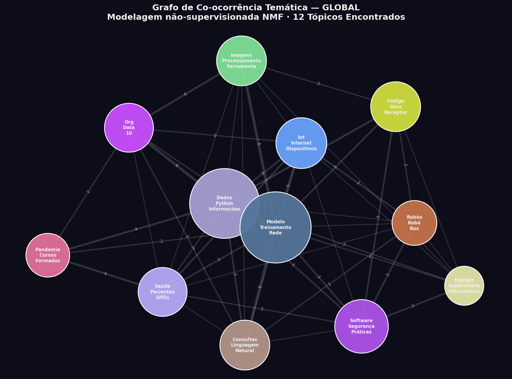
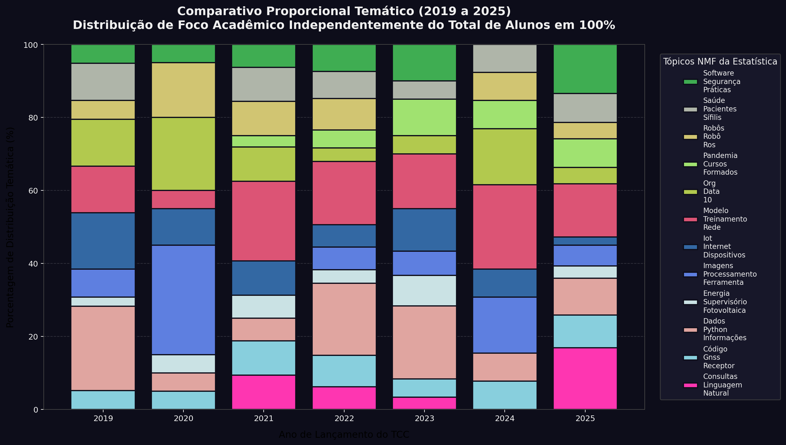

# ThesisMiner(AI Topic Modeling)

Uma pipeline automatizada de mineração de textos desenvolvida para analisar tendências tecnológicas e elencar as grandes áreas temáticas dos TCCs do curso de Engenharia de Computação (UFRN). O projeto utiliza **Inteligência Artificial Não-Supervisionada (NMF e TF-IDF)** em conjunto com Processamento de Linguagem Natural para descobrir e mapear de forma autônoma quais são os verdadeiros focos e clusters de estudo no ambiente acadêmico atual.

## O que ele faz?
1. **Scraping** de de TCCs publicados no repositório oficial da Universidade do período de 2019 a 2025.
2. **Extração Contextual** de Resumos e Conclusões via Regex parsing de Padrões LaTeX e PDFs.
3. **Descoberta Dinâmica de Áreas Matemáticas** processando todo o corpo da pesquisa utilizando o algoritmo Scikit-Learn `NMF` com filtros robustos no Spacy, extraindo os Tópicos-Chave independentes de amarras.
4. **Exportação de Grafos** em Alta Qualidade (PNG) e Histograma empilhado, revelando a adesão tecnológica ano a ano (Total x 100%).
5. **Dashboard Interativo** que permite explorar os grafos sob uma ótica _Glassmorphism_ em Física Espacial 2D via arquivo offline único.

---

## 🛠 Como Instalar

Certifique-se de estar utilizando Python `^3.10` em um Virtual Environment (`venv`):

```bash
# 1. Instale as dependências da suíte
pip install -r requirements.txt

# 2. Como a IA exige stopwords de alta qualidade, baixe o pacote pt_core do Spacy
python -m spacy download pt_core_news_lg
```

---

## 🏗 Ordem de Execução do Pipeline

A análise precisa rodar o motor em cascata. Acione os scripts pela seguinte ordem:

| Script | Função |
|---|---|
| `01_scraper.py` | Baixa os PDFs crus filtrados para os anos alvos pela API REST do DSpace. |
| `02_section_extractor.py` | Minera texto dos PDFs isolando a essência nas variáveis JSON interinas. |
| `05_area_analyzer.py` | Núcleo do **Machine Learning**. Vetoriza os textos via TF-IDF e gera Matrizes Não-Negativas (NMF) que definem quais os Tópicos orgânicos e cria a rede conectada Global e Anual. |
| `06_visualizer.py` | Constrói o Painel da Rede Neural do Zero: o super `visualizacao_novo.html`. |
| `07_export_pngs.py` | Lê a mecânica neural local e exporta lindas imagens estáticas em PNG de alta resolução. |
| `08_plot_histogram.py` | Desenha o Histograma de Transição de Séries Históricas em dois gráficos. |

---

## O Visualizador (Dashboard)

A maior entrega do repositório encontra-se renderizada para acesso fácil. Toda a visualização não usa Frameworks complexos que bloqueiem uso diário de professores. Ela foi embutida dentro de:
`data/graphs/visualizacao_novo.html`

Basta duplo clique para interagir com a interface _Dark Mode_ no navegador e testar a física visual. Nenhuma infraestrutura backend requerida após a geração do Python!

---

## Principais Resultados e Imagens Ilustrativas

Abaixo estão as evidências do processamento gerado pela modelagem NMF ao longo da série histórica dos trabalhos publicados:

### Grafo de Co-ocorrência Temática Global
A rede semântica formou nativamente o agrupamento orgânico das tecnologias e estudos mais aplicados por todo o curso de engenharia:


### Histograma Proporcional da Evolução
A análise de distribuição temporal demonstra como as ondas acadêmicas se comportaram de forma estritamente independente do volume total de alunos por ano:


---

## Análise e Discussão dos Achados

A mineração de texto autônoma apontou claramente as transições de interesse tecnológico do curso de Engenharia de Computação nos últimos anos:
- **A Hegemonia de Dados e IA:** Tópicos interconectados voltados a `Dados / Python / Informações` e `Modelo / Treinamento / Rede` solidificaram Inteligência Artificial como a vertente com o crescimento mais vertical da história do repositório, ancorada à evolução de bibliotecas de Machine Learning.
- **Reflexos Sociais:** A inteligência processou traços como `Pandemia / Cursos / Formados` concentrados no recorte atípico entre 2020 e 2021, ilustrando trabalhos de conclusão adaptados à realidade de ensino remoto e saúde.
- **Aplicações Físicas Ciber-Físicas:** Clusters estruturais de `Robôs / Robô / Ros` e `Iot / Internet / Dispositivos` demonstram a estabilidade e amadurecimento contínuo de sistemas embarcados e robótica aliada à modernização do setor.

---

## Vídeo de Apresentação

Confira o vídeo gravado contendo a introdução do pipeline em funcionamento, os critérios do NMF aplicados e a explanação dos resultados e dashboards finais na plataforma Loom:
▶️ **[Assistir à Apresentação do Projeto (Loom)](https://www.loom.com/share/cbd6a02345264fd88404ddb9c7bc04bc)**

---

## 👥 Autores

**Gabriel Neto · Sara Gabrielly · Ícaro Cortês**  
UFRN — Departamento de Engenharia de Computação e Automação  
Disciplina: *Algoritmos e Estrutura de Dados II*